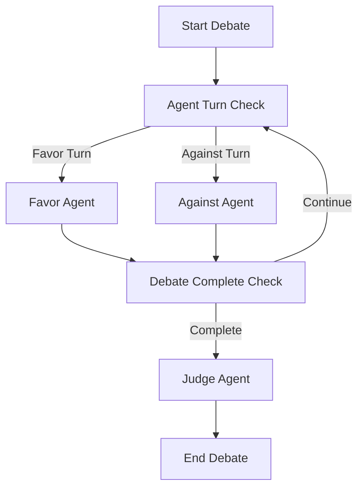
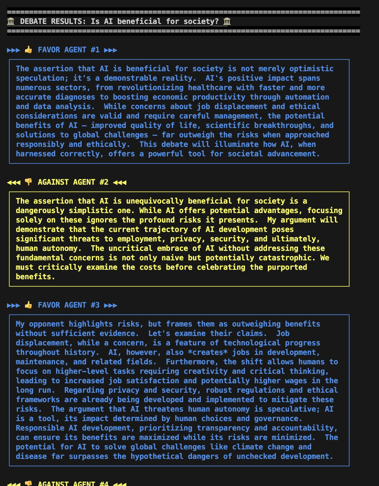

# Multi Agent Simple Debate System

A sophisticated multi-agent debate system built with LangGraph that orchestrates structured debates between AI agents with opposing viewpoints, culminating in an impartial evaluation.

## Overview

This system implements a three-agent debate architecture where specialized AI agents conduct intelligent discussions:

- **Favor Agent**: Advocates for the debate topic with logical, persuasive arguments
- **Against Agent**: Presents critical evaluations and thoughtful counterarguments  
- **Judge Agent**: Provides impartial evaluation and renders final verdict

The system leverages LangGraph's state-driven execution model to orchestrate turn-based debates with phase-aware agent behavior.

## System Variants

### Simple Debate System
The foundational debate system with transparent communication and straightforward argumentation patterns.

### Strategic Debate System
An advanced variant that extends the simple system with:
- **Hidden Strategy Formulation**: Agents develop confidential debate strategies
- **Psychological Manipulation**: Fact-based persuasion techniques and cognitive bias awareness
- **Meta-Analysis**: Post-debate strategic assessment revealing hidden elements
- **Enhanced Judge Evaluation**: Weighted criteria and strategic effectiveness analysis

## Key Features

- **State-Driven Architecture**: Centralized [`DebateState`](src/models/debate_state.py) management with turn coordination
- **Phase-Based Behavior**: Agents adapt their responses based on debate progression (introduction → argumentation → conclusion)
- **LLM Integration**: Powered by Google's Gemini models with configurable parameters
- **Structured Output**: Enhanced formatting with color-coded agent responses
- **Extensible Design**: Modular architecture supporting custom agent types and debate flows
- **Strategic Intelligence**: Advanced prompt engineering for sophisticated debate tactics

## Architecture

The system follows a deterministic state machine pattern:

### Simple System Flow
```
START → agent_turn_check → [favor_agent | against_agent] → debate_complete_check → [continue | judge_agent] → END
```

### Strategic System Flow
```
START → agent_turn_check → [favor_agent | against_agent] → debate_complete_check → [continue | judge_agent] → strategy_analysis → END
```

### Turn-Based Execution Model



Each agent inherits from [`DebateBaseAgent`](src/agents/base_agent.py) and utilizes structured prompts from [`ActionPrompts`](src/prompts/action_prompts.py) for basic functionality or [`StrategicActionPrompts`](src/prompts/strategic_action_prompts.py) for advanced strategic behavior. For detailed architecture information, see [docs/architecture.md](docs/architecture.md).



## Prerequisites

- Python 3.12+
- Google API Key for Gemini models
- UV package manager

## Installation

1. Clone the repository:
```bash
git clone <repository-url>
cd simple-discussion-agents
```

2. Install dependencies using UV:
```bash
uv sync
```

3. Set up environment variables:
```bash
cp .env.example .env
# Add your GOOGLE_API_KEY to .env
```

## Usage

### Simple Debate System

```python
from src.graph.debate_graph import DebateGraph

# Initialize the basic debate system
debate_graph = DebateGraph(verbose=True)

# Run a debate on any topic
result = debate_graph.run_debate("Is AI beneficial for society?", max_steps=3)

# Display formatted results
debate_graph.print_debate(result)
```

### Strategic Debate System

```python
from src.graph.strategic_debate_graph import StrategicDebateGraph

# Initialize the strategic debate system
strategic_graph = StrategicDebateGraph(verbose=True, use_strategic_prompt=True)

# Run a strategic debate with hidden strategies
result = strategic_graph.run_debate("Is AI beneficial for society?", max_steps=3)

# Display results with strategy analysis
strategic_graph.print_debate(result)
```

### Command Line Usage

**Simple Debate:**
```bash
python main.py
```

**Strategic Debate:**
```bash
python strategy_debate.py
```

### Configurable Parameters

```python
# Simple system
debate_graph = DebateGraph(
    model_name="gemini-1.5-flash",
    max_output_tokens=1024,
    temperature=0.5,
    verbose=True
)

# Strategic system
strategic_graph = StrategicDebateGraph(
    model_name="gemini-1.5-flash",
    max_output_tokens=1024,
    temperature=0.5,
    verbose=True,
    use_strategic_prompt=True
)
```

## Project Structure

```
simple-discussion-agents/
├── src/
│   ├── agents/          # AI agent implementations
│   ├── graph/           # LangGraph debate orchestration
│   │   ├── debate_graph.py           # Simple debate system
│   │   └── strategic_debate_graph.py # Strategic debate system
│   ├── models/          # Data models and state management
│   ├── prompts/         # Prompt templates and configurations
│   │   ├── action_prompts.py         # Basic prompts
│   │   └── strategic_action_prompts.py # Strategic prompts
│   └── utils/           # Utility functions
├── docs/               # Architecture documentation
│   ├── architecture.md              # Simple system architecture
│   └── strategic_debate_agent.md    # Strategic system architecture
├── resources/          # Assets and examples
├── tests/             # Test suite
├── main.py            # Simple debate CLI entry point
└── strategy_debate.py # Strategic debate CLI entry point
```

## Core Components

- **[`DebateGraph`](src/graph/debate_graph.py)**: Main orchestration engine for simple debates
- **[`StrategicDebateGraph`](src/graph/strategic_debate_graph.py)**: Advanced orchestration with strategic capabilities
- **[`FavorAgent`](src/agents/favor_agent.py)**: Supports debate topics with logical arguments
- **[`AgainstAgent`](src/agents/against_agent.py)**: Opposes topics with critical analysis
- **[`JudgeAgent`](src/agents/judge_agent.py)**: Provides impartial evaluation and strategic analysis
- **[`DebateState`](src/models/debate_state.py)**: Centralized state management

## Strategic Features

The strategic debate system introduces advanced capabilities:

- **Strategy Formulation**: Hidden strategy development based on psychological principles
- **Multi-layered Arguments**: Four-layer response strategy (defensive, offensive, psychological, adaptive)
- **Fact-based Manipulation**: Ethical persuasion techniques using factual information
- **Meta-Analysis**: Post-debate revelation of strategic effectiveness
- **Enhanced Evaluation**: Weighted judge criteria and strategic assessment

For detailed information about strategic capabilities, see [docs/strategic_debate_agent.md](docs/strategic_debate_agent.md).

## Example Output

The system produces structured debates with color-coded agent responses, conversation history tracking, and comprehensive judge evaluations. Each debate progresses through introduction, argumentation, and conclusion phases with intelligent agent adaptation.

**Strategic debates additionally provide:**
- Hidden strategy revelation
- Manipulation technique analysis
- Strategic interaction assessment
- Educational insights into debate tactics

## Contributing

1. Fork the repository
2. Create a feature branch (`git checkout -b feature/amazing-feature`)
3. Make your changes
4. Run tests and linting (`ruff check`)
5. Commit your changes (`git commit -m 'Add amazing feature'`)
6. Push to the branch (`git push origin feature/amazing-feature`)
7. Open a Pull Request

## License

This project is licensed under the MIT License - see the [LICENSE](LICENSE) file for details.

## Authors

- **Suraj Airi** - *Initial work* - [surajairi.ml@gmail.com](mailto:surajairi.ml@gmail.com)