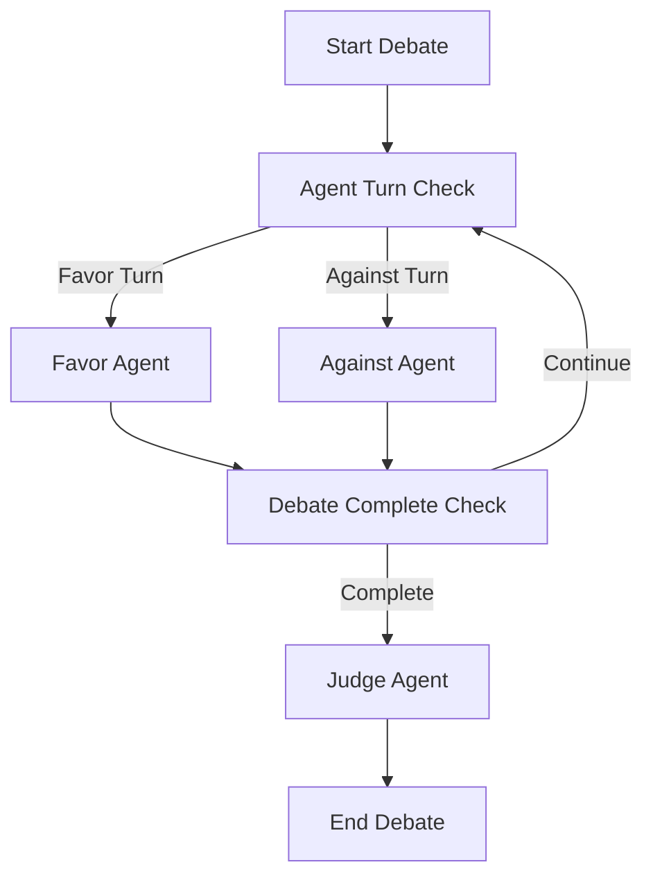

# Multi Agent Simple Debate System

A sophisticated multi-agent debate system built with LangGraph that orchestrates structured debates between AI agents with opposing viewpoints, culminating in an impartial evaluation.

## Overview

This system implements a three-agent debate architecture where specialized AI agents conduct intelligent discussions:

- **Favor Agent**: Advocates for the debate topic with logical, persuasive arguments
- **Against Agent**: Presents critical evaluations and thoughtful counterarguments  
- **Judge Agent**: Provides impartial evaluation and renders final verdict

The system leverages LangGraph's state-driven execution model to orchestrate turn-based debates with phase-aware agent behavior.

## Key Features

- **State-Driven Architecture**: Centralized [`DebateState`](src/models/debate_state.py) management with turn coordination
- **Phase-Based Behavior**: Agents adapt their responses based on debate progression (introduction → argumentation → conclusion)
- **LLM Integration**: Powered by Google's Gemini models with configurable parameters
- **Structured Output**: Enhanced formatting with color-coded agent responses
- **Extensible Design**: Modular architecture supporting custom agent types and debate flows

## Architecture

The system follows a deterministic state machine pattern:

```
START → agent_turn_check → [favor_agent | against_agent] → debate_complete_check → [continue | judge_agent] → END
```

### Turn-Based Execution Model



Each agent inherits from [`DebateBaseAgent`](src/agents/base_agent.py) and utilizes structured prompts from [`ActionPrompts`](src/prompts/action_prompts.py) for consistent behavior. For detailed architecture information, see [docs/architecture.md](docs/architecture.md).

## Preview. 


## Prerequisites

- Python 3.12+
- Google API Key for Gemini models
- UV package manager

## Installation

1. Clone the repository:
```bash
git clone <repository-url>
cd simple-discussion-agents
```

2. Install dependencies using UV:
```bash
uv sync
```

3. Set up environment variables:
```bash
cp .env.example .env
# Add your GOOGLE_API_KEY to .env
```

## Usage

### Basic Debate Execution

```python
from src.graph.debate_graph import DebateGraph

# Initialize the debate system
debate_graph = DebateGraph(verbose=True)

# Run a debate on any topic
result = debate_graph.run_debate("Is AI beneficial for society?", max_steps=3)

# Display formatted results
debate_graph.print_debate(result)
```

### Command Line Usage

```bash
python main.py
```

### Configurable Parameters

```python
debate_graph = DebateGraph(
    model_name="gemini-1.5-flash",
    max_output_tokens=1024,
    temperature=0.5,
    verbose=True
)
```

## Project Structure

```
simple-discussion-agents/
├── src/
│   ├── agents/          # AI agent implementations
│   ├── graph/           # LangGraph debate orchestration
│   ├── models/          # Data models and state management
│   ├── prompts/         # Prompt templates and configurations
│   └── main.py         # Application entry point
├── docs/               # Architecture documentation
├── resources/          # Assets and examples
├── tests/             # Test suite
└── main.py           # CLI entry point
```

## Core Components

- **[`DebateGraph`](src/graph/debate_graph.py)**: Main orchestration engine using LangGraph
- **[`FavorAgent`](src/agents/favor_agent.py)**: Supports debate topics with logical arguments
- **[`AgainstAgent`](src/agents/against_agent.py)**: Opposes topics with critical analysis
- **[`JudgeAgent`](src/agents/judge_agent.py)**: Provides impartial evaluation and verdict
- **[`DebateState`](src/models/debate_state.py)**: Centralized state management

## Example Output

The system produces structured debates with color-coded agent responses, conversation history tracking, and comprehensive judge evaluations. Each debate progresses through introduction, argumentation, and conclusion phases with intelligent agent adaptation.

## Contributing

1. Fork the repository
2. Create a feature branch (`git checkout -b feature/amazing-feature`)
3. Make your changes
4. Run tests and linting (`ruff check`)
5. Commit your changes (`git commit -m 'Add amazing feature'`)
6. Push to the branch (`git push origin feature/amazing-feature`)
7. Open a Pull Request

## License

This project is licensed under the MIT License - see the [LICENSE](LICENSE) file for details.

## Authors

- **Suraj Airi** - *Initial work* - [surajairi.ml@gmail.com](mailto:surajairi.ml@gmail.com)