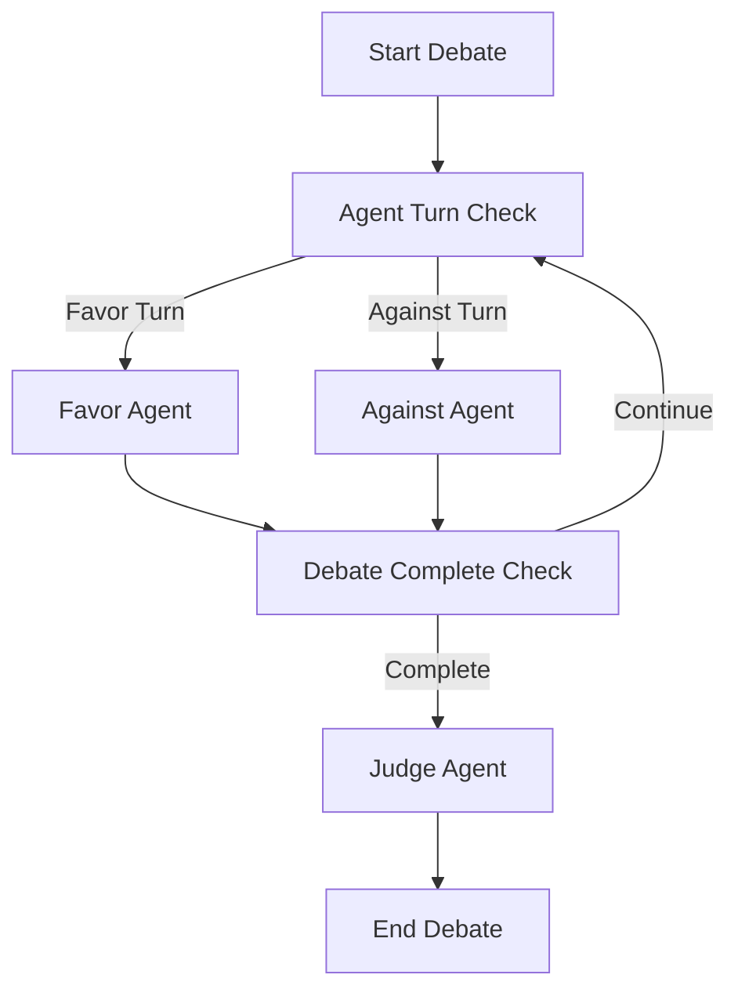

# Multi-Agents Simple Debate Graph Architecture

## Overview

The Simple Discussion Agents system implements a multi-agent debate architecture using LangGraph, where three specialized AI agents collaborate to conduct structured debates. The system leverages a state-driven graph execution model to orchestrate intelligent discussions between opposing viewpoints, culminating in an impartial evaluation.

## Core Architecture Components

### 1. Agent Hierarchy

The system employs a three-agent architecture with distinct roles and responsibilities:

#### Primary Debate Agents
- **Favor Agent** ([`FavorAgent`](/src/agents/favor_agent.py)): Advocates for the debate topic
- **Against Agent** ([`AgainstAgent`](/src/agents/against_agent.py)): Opposes the debate topic

#### Evaluation Agent
- **Judge Agent** ([`JudgeAgent`](/src/agents/judge_agent.py)): Provides impartial evaluation and conclusion

### 2. State Management Architecture

The debate system uses a centralized state model ([`DebateState`](/src/models/debate_state.py)) that maintains:

```python
DebateState = {
    "topic": str,                    # Current debate topic
    "favor_strategy": str,           # Favor agent's strategy
    "against_strategy": str,         # Against agent's strategy  
    "messages": List[Tuple[str, str]], # Conversation history
    "current_turn": AgentRole,       # Active agent indicator
    "current_step": int,             # Current debate round
    "max_steps": int                 # Maximum debate rounds
}
```

## Graph Execution Flow

### 1. Control Flow Architecture

The debate follows a deterministic state machine pattern implemented in [`DebateGraph`](/src/graph/debate_graph.py):

```
START → agent_turn_check → [favor_agent | against_agent] → debate_complete_check → [continue | judge_agent] → END
```

### 2. Turn-Based Execution Model



### 3. Phase-Based Agent Behavior

Each debate agent exhibits different behaviors based on the current debate phase:

#### Introduction Phase (`current_step == 1`)
- **Favor Agent**: Introduces topic and presents initial supporting position
- **Against Agent**: Introduces counter-perspective and establishes opposition stance

#### Argumentation Phase (`1 < current_step < max_steps`)
- **Favor Agent**: Develops supporting arguments and responds to opposition
- **Against Agent**: Presents counter-arguments and challenges favor position

#### Conclusion Phase (`current_step >= max_steps`)
- **Favor Agent**: Summarizes strongest supporting points
- **Against Agent**: Summarizes strongest opposing points
- **Judge Agent**: Evaluates entire debate and renders verdict

## Agent Intelligence Architecture

### 1. Base Agent Framework

All agents inherit from [`DebateBaseAgent`](/src/agents/base_agent.py), providing:

- **Context Processing**: Handles debate state and message history
- **LLM Integration**: Manages language model interactions
- **Action Dispatching**: Routes requests to appropriate response methods
- **Role Enforcement**: Maintains agent-specific behavioral constraints

### 2. Prompt Engineering System

The architecture employs a structured prompt system ([`ActionPrompts`](/src/prompts/action_prompts.py)) that provides:

- **Context-Aware Templates**: Dynamic prompt generation based on debate state
- **Role-Specific Instructions**: Tailored guidance for each agent type
- **Consistency Mechanisms**: Ensures coherent agent behavior across phases

### 3. Agent Specialization

#### Favor Agent Specialization
```python
# System prompt focus: Logical, persuasive, supportive arguments
# Behavioral constraints: Defend core ideas, address counterpoints respectfully
# Tone requirements: Confident, constructive
```

#### Against Agent Specialization  
```python
# System prompt focus: Critical evaluation, logical objections
# Behavioral constraints: Highlight flaws, risks, weaknesses
# Tone requirements: Composed, assertive, thoughtful
```

#### Judge Agent Specialization
```python
# System prompt focus: Impartial evaluation, balanced assessment
# Behavioral constraints: Analyze clarity, logic, persuasiveness
# Evaluation criteria: Objective, fair, comprehensive
```

## Communication Architecture

### 1. Message Protocol

The system uses a structured message format:
```python
Message = Tuple[AgentName: str, Content: str]
```

### 2. State Synchronization

- **Shared State**: All agents access the same [`DebateState`](/src/models/debate_state.py)
- **Immutable History**: Message history preserves complete debate context
- **Turn Management**: [`AgentRole`](/src/models/debate_state.py) enum ensures proper sequencing

### 3. Context Propagation

Each agent receives:
- Complete conversation history
- Current debate phase information
- Role-specific contextual cues
- Strategic guidance based on debate progression

## LLM Integration Architecture

### 1. Model Abstraction Layer

The system abstracts LLM interactions through:
- **BaseLanguageModel Interface**: Provides consistent LLM access
- **Configurable Parameters**: Supports temperature, token limits, model selection
- **Response Processing**: Standardizes output handling across agents

### 2. Agent-LLM Binding

```python
# Each agent receives a dedicated LLM instance
FavorAgent(llm=ChatGoogleGenerativeAI(...))
AgainstAgent(llm=ChatGoogleGenerativeAI(...))  
JudgeAgent(llm=ChatGoogleGenerativeAI(...))
```

### 3. Prompt Execution Pipeline

```
Agent Request → Prompt Template → Context Injection → LLM Invocation → Response Processing → State Update
```

## Scalability and Extensibility

### 1. Agent Extensibility

The base agent architecture supports:
- **Custom Agent Types**: Easy creation of specialized debate roles
- **Behavioral Modification**: Configurable agent personalities and strategies
- **Tool Integration**: Capability for agents to use external tools and resources

### 2. Graph Flexibility

The LangGraph implementation allows:
- **Dynamic Flow Modification**: Runtime changes to debate structure
- **Conditional Logic**: Complex decision trees for debate progression
- **Parallel Processing**: Potential for concurrent agent operations

### 3. State Evolution

The state management system supports:
- **State Extensions**: Additional metadata and context tracking
- **Custom Transitions**: Domain-specific debate flow modifications
- **Event Handling**: Integration with external systems and notifications

## Quality Assurance Architecture

### 1. Input Validation

- **State Validation**: Ensures debate state integrity at each step
- **Message Validation**: Verifies agent response format and content
- **Configuration Validation**: Validates agent configurations and parameters

### 2. Error Handling

- **Graceful Degradation**: System continues operation despite individual agent failures
- **Recovery Mechanisms**: Automatic retry and fallback strategies
- **Error Propagation**: Structured error reporting and debugging support

### 3. Performance Monitoring

- **Response Time Tracking**: Monitors agent response latencies
- **Quality Metrics**: Evaluates debate coherence and engagement
- **Resource Utilization**: Tracks LLM token usage and computational costs

## Security and Governance

### 1. Agent Behavior Constraints

- **Role Enforcement**: Prevents agents from exceeding defined capabilities
- **Content Filtering**: Ensures appropriate and respectful debate content
- **Output Validation**: Verifies agent responses meet quality standards

### 2. Access Control

- **API Key Management**: Secure handling of LLM service credentials
- **Rate Limiting**: Prevents abuse and manages resource consumption
- **Audit Logging**: Tracks agent actions and system interactions

This architecture provides a robust foundation for conducting structured, intelligent debates while maintaining